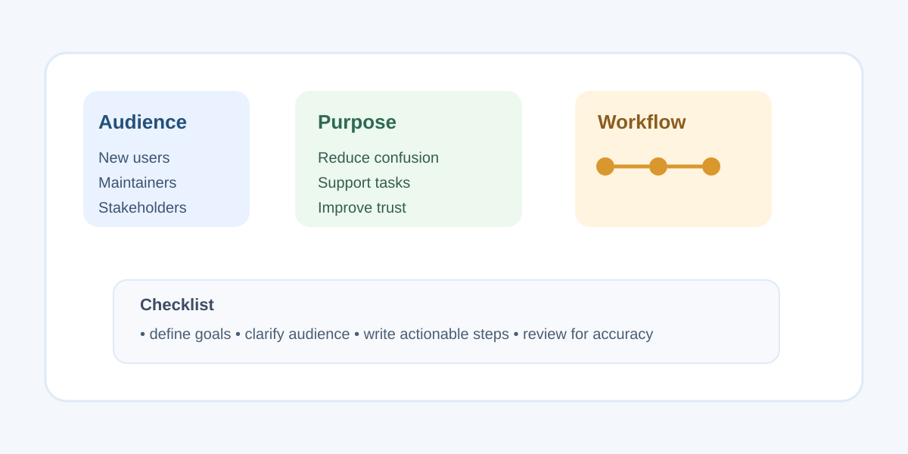

Documentation is often treated as an afterthought, something created only when a release is nearly complete or a problem appears. In practice, good documentation is a strategic tool. It reduces confusion, supports new contributors, and creates a stable record of decisions that otherwise live only in private conversations or scattered notes.

The strongest documentation plans begin with a clear understanding of the audience. A novice user needs different guidance than a teammate maintaining a production system or a technical stakeholder reviewing a roadmap. When teams skip this step, they write content that is either too basic to be useful or too dense to be readable. A strong documentation plan identifies who the reader is, what they want to do, and what problem they are trying to solve.

## Start with purpose, not pages

Rather than drafting pages immediately, write down the purpose of the documentation. Ask: What decisions does this content help someone make? What tasks should it make easier? Which workflows are confusing or repeated often enough to deserve a written explanation? This framing keeps the writing practical. It also helps teams decide what to leave out. Documentation should be useful first and complete second.

A simple structure is often enough:

- Overview of the topic
- Step-by-step instructions
- Required context or prerequisites
- Troubleshooting or common mistakes
- Links to related reference material

This pattern makes content easier to scan and easier to maintain when the project changes. It also makes the documentation feel consistent across articles.

## Keep content discoverable

Even excellent information fails if people cannot find it. Searchability matters. Titles should be specific, headings should reflect user intent, and links should lead to real tasks rather than abstract categories. For example, a page titled “Deployment checklist” is clearer than “Release documentation,” especially when a user is trying to complete a concrete action.

A documentation plan should also include maintenance ownership. Someone should be responsible for checking whether instructions still match the current system. Without that accountability, documentation slowly drifts away from reality. This is one of the main reasons teams lose trust in their own guides.

## Build for iteration

Documentation should evolve with the product. The best documentation plans treat content as living material that improves with use. Encourage feedback, note unanswered questions, and update pages when workflows change. That habit turns documentation into a working system rather than a static archive.

In the end, the goal is not to produce perfect prose. The goal is to create information that helps people act with confidence. When a team plans documentation around user needs, maintainability, and clarity, the result is a resource people actually use.
