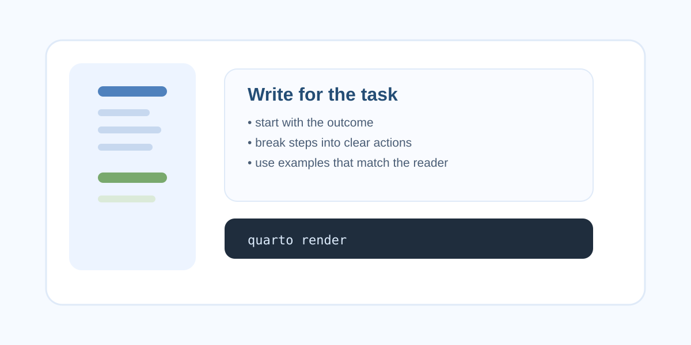
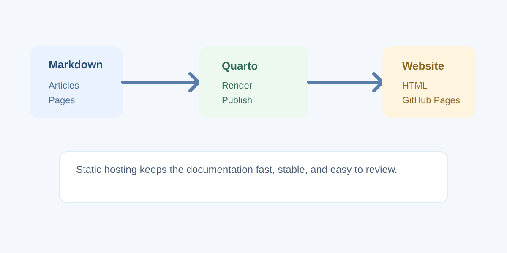

  

    <section class="hero-copy">
      <h1>Minimalism at its finest.</h1>
      <a class="cta-link" href="#featured">Shop all</a>
      

        <a href="#">f</a>
        <a href="#">x</a>
        <a href="#">in</a>
      

    </section>

    

      <article class="feature-card">
        
        
Kitchen

      </article>

      <article class="feature-card">
        
        
Bathroom

      </article>

      <article class="feature-card">
        
        
Lighting

      </article>
    

  

## Featured articles

This landing page introduces a dark, editorial aesthetic for the documentation mini-site. The project still includes the same article set, arranged as a clean minimal direction that feels more like a design showcase than a standard documentation page.

- [Planning documentation that people actually use](docs/articles/article-1.qmd)
- [Writing concise, readable technical content](docs/articles/article-2.qmd)
- [Publishing a static documentation site with Quarto](docs/articles/article-3.qmd)

